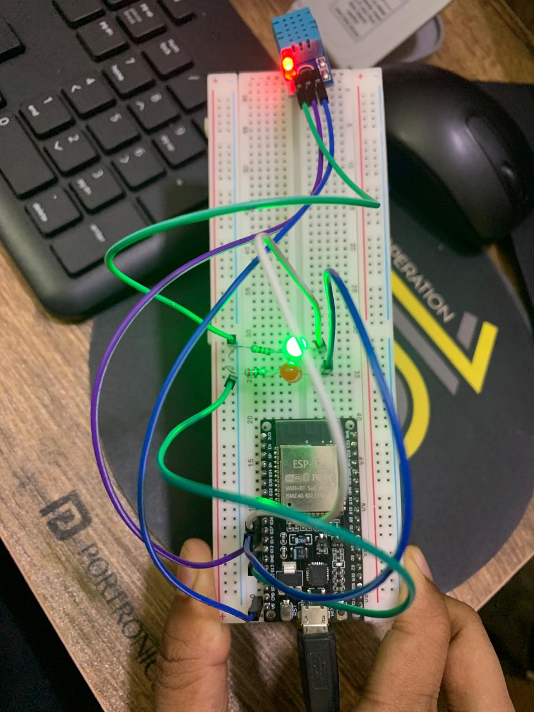

### Pinout Diagram

Here is the wiring for the project:

GND -> GND (All Components) 

V5 -> VCC (DHT11)       

GPIO14 -> Data Pin (DHT11) 

GPIO27 -> Anode (+) of Red LED

GPIO26 -> Anode (+) of Green LED

* The Red LED's cathode (-) connects to GND via a ~220Ω resistor.

* The Green LED's cathode (-) connects to GND via a ~220Ω resistor.

