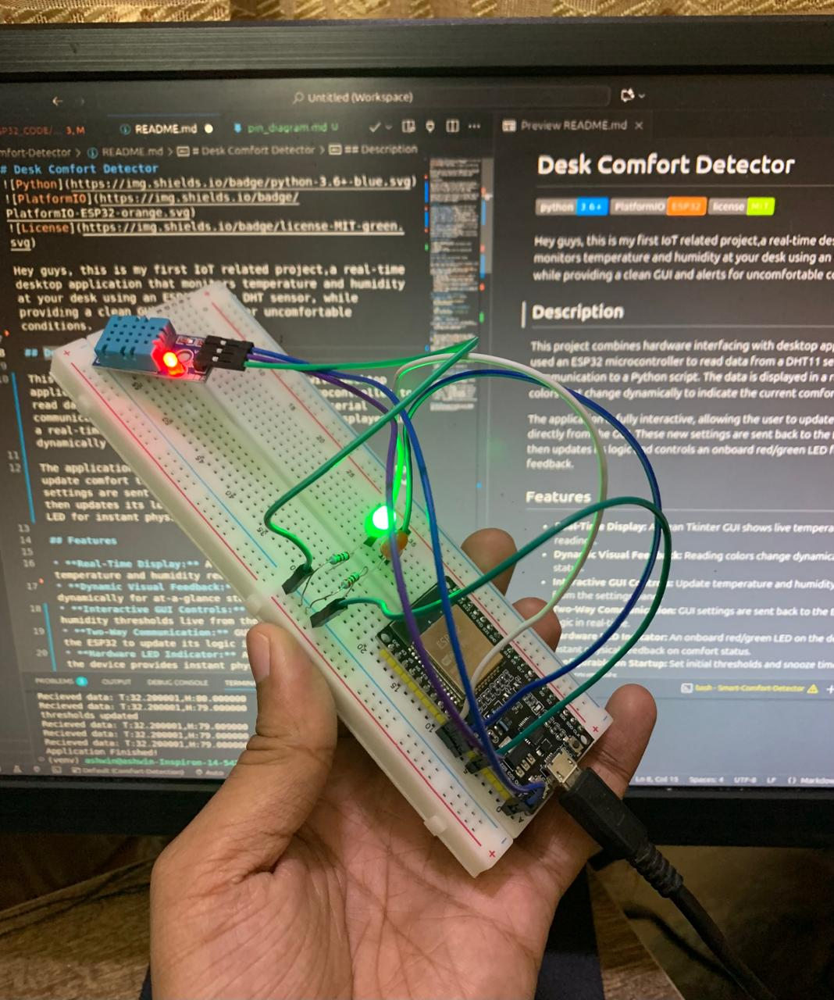
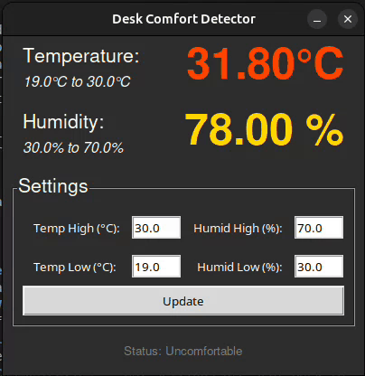
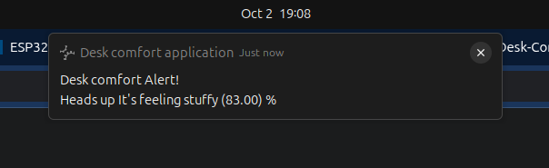

# Desk Comfort Detector


Hey guys, this is my first IoT related project,a real-time desktop application that monitors temperature and humidity at your desk using an ESP32 and a DHT sensor, while providing a clean GUI and alerts for uncomfortable conditions.



## Description

This project combines hardware interfacing with desktop application development. I used an ESP32 microcontroller to read data from a DHT11 sensor and send it via serial communication to a Python script. The data is displayed in a real-time Tkinter GUI, with colors that change dynamically to indicate the current comfort level.

The application is fully interactive, allowing the user to update comfort thresholds directly from the GUI. These new settings are sent back to the ESP32 in real-time, which then updates its logic and controls an onboard red/green LED for instant physical feedback.


## Features

* **Real-Time Display:** A clean Tkinter GUI shows live temperature and humidity readings.
* **Dynamic Visual Feedback:** Reading colors change dynamically for at-a-glance status.
* **Interactive GUI Controls:** Update temperature and humidity thresholds live from the settings panel.
* **Two-Way Communication:** GUI settings are sent back to the ESP32 to update its logic in real-time.
* **Hardware LED Indicator:** An onboard red/green LED on the device provides instant physical feedback on comfort status.
* **Configurable on Startup:** Set initial thresholds and snooze timers via command-line arguments.
* **Desktop Notifications:** Get pop-up alerts with sound when conditions are uncomfortable.

* **Adjustable Snooze:** Control how often notifications appear with a configurable snooze timer.
* **Robust & Cross-Platform:** Built with standard Python libraries for wide compatibility.

## Hardware Requirements

* An ESP32 development board
* A DHT11 or DHT22 temperature and humidity sensor
* 1x Red LED
* 1x Green LED
* 2x Resistors (220kΩ)
* A breadboard and jumper wires for connecting the components

## Software & Setup

Follow these steps to get the project running.

### 1. Firmware (ESP32 Setup)

This project uses PlatformIO for firmware management, which makes setup simple and reproducible.

* **Prerequisites:** You'll need [Visual Studio Code](https://code.visualstudio.com/) with the [PlatformIO IDE extension](https://platformio.org/install/ide?install=vscode) installed.
* **Upload the Code:**
    1.  Open the main `Desk-Comfort-Detector` folder in Visual Studio Code.
    2.  The PlatformIO extension should automatically recognize the project located in the `esp32_code/` directory.
    3.  PlatformIO will automatically download the correct board drivers and any libraries specified in `platformio.ini`.
    4.  Once it's ready, click the **"Upload"** button (an arrow icon) in the PlatformIO toolbar at the bottom of the VS Code window.

### 2. Desktop Application (Python Setup)

* **Prerequisites:** Python 3.6+ is required.
* **Clone the Repository:**
    ```bash
    git clone (https://github.com/Shanwis/Desk-Comfort-Detector)
    cd Desk-Comfort-Detector
    ```
* **Create a Virtual Environment (Recommended):**
    ```bash
    python3 -m venv venv
    source venv/bin/activate  # On Windows, use `venv\Scripts\activate`
    ```
* **Install Dependencies:**
    ```bash
    pip install -r requirements.txt
    ```
* **Platform-Specific Notes (Linux):** You may need to install some system libraries for Pygame to work correctly.
    ```bash
    sudo apt-get install libsdl2-mixer-2.0-0 libsdl2-image-2.0-0 libsdl2-2.0-0
    ```

## Usage

1.  Make sure your ESP32 is plugged into your computer.
2.  Find the correct serial port name for your device (e.g., `COM3` on Windows, `/dev/ttyUSB0` on Linux). You may need to edit this in the `Comfort_script.py` file.
3.  Run the script from your terminal:
    ```bash
    python3 Comfort_script.py
    ```
The GUI will appear and start displaying readings. You can change the thresholds in the "Settings" panel and click "Update" to apply them to both the GUI and the ESP32.

### Command-Line Arguments

You can customize the behavior without editing the code:

* **Set temperature thresholds:**
    ```bash
    python3 Comfort_script.py --tempmax 32 --templow 18
    ```
* **Set humidity thresholds:**
    ```bash
    python3 Comfort_script.py --humiditymax 65 --humiditylow 35
    ```
* **Set the notification snooze time (in seconds):**
    ```bash
    python3 Comfort_script.py --snooze 300
    ```
### All Options

```
usage: Comfort_script.py [-h] [-th TEMPMAX] [-tl TEMPLOW] [-hh HUMIDITYMAX] [-hl HUMIDITYLOW] [-s SNOOZE]

options:
  -h, --help            show this help message and exit
  -th TEMPMAX, --tempmax TEMPMAX  
                        Set highest acceptable temperature
  -tl, TEMPLOW, --templow TEMPLOW 
                        Set lowest acceptable temperature
  -hh HUMIDITYMAX, --humiditymax HUMIDITYMAX 
                        Set highest acceptable humidity
  -hl; HUMIDITYLOW, --humiditylow HUMIDITYLOW 
                        Set lowest acceptable humidity
  -s SNOOZE, --snooze SNOOZE 
                The amount of time between each notification
```

## Future Scope
I was super excited to do this project as I am stepping into an exiting new domain. I will be trying to add more features into this Desk Comfort Detector to learn more about sensors and microcontrollers.